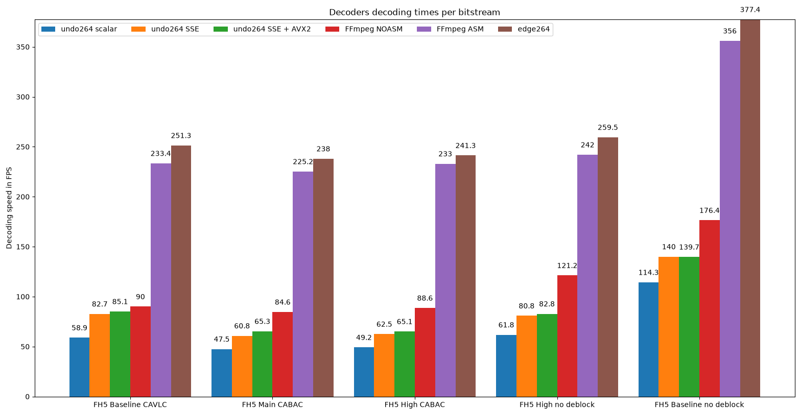
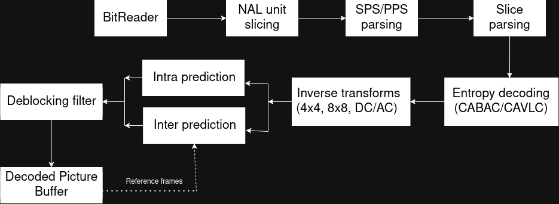

# undo264

A H.264 decoder written in C


# Features and Scope
Baseline profile, Main and High profile:
- Single threaded
- CAVLC (Context-Adaptive Variable Length Coding)
- CABAC (Context-Adaptive Binary-Arithmetic Coding)
- I/P/B slices
- Weighted prediction
- 8x8 transforms 
- Custom scaling lists
- Deblocking filter
- Memory management control operations (MMCOs)
- Long-term reference pictures
- YUV 4:2:0 and monochrome output

Does and will not support :
- MBAFF/PAFF
- Picture field coding
- FMO (multiple slice groups)
- ASO (arbitrary slice ordering)
- Any format other than 4:2:0 or monochrome
- Profiles: CAVLC 4:4:4, High 10-bit, High 4:2:2, High 4:4:4


# Correctness and Testing

Undo264 gives bit-exact output on all official ITU-T conformance bitstreams for Baseline, Main and High profiles
(AVCv1 and FRExt suites), excluding bitstreams that are out of this decoder's scope. 

A script for downloading the AVCv1 (Baseline, Main) and FRExt (High) suites is available in the test/ folder, 
as well as an automated script to run those test suites 
and compare undo264's output either against given reference decoded files or against FFmpeg's H.264 decoder output, 
which is supposed to be bit-exact. 

To run the test suites in the test/ folder : 
```shell
chmod +x download_vectors.sh && chmod +x conformance_test.sh
./download_vectors.sh # may take a while to download and extract
./conformance_test.sh AVCv1
./conformance_test.sh FRExt
```


# Benchmarks




*Benchmark computed by medians of 5 runs for each of the 5 bitstreams 
(the Forza Horizon 5 trailer in 1080p, re-encoded with different profiles and settings for each set of runs)*

Below is a table with the decoding speeds in FPS shown above :

|                         |  undo264 scalar  | undo264 SSE   | undo264 SSE+AVX2  |  FFmpeg NOASM  |  FFmpeg ASM  |  edge264  |  
|-------------------------|:----------------:|:-------------:|:-----------------:|:--------------:|:------------:|:---------:|
| FH5 Baseline CAVLC      |       58.9       |     82.7      |       85.1        |       90       |    233.4     |   251.3   |  
| FH5 Main CABAC          |       47.5       |     60.8      |       65.3        |      84.6      |    225.2     |    238    |
| FH5 High CABAC          |       49.2       |     62.5      |       65.1        |      88.6      |     233      |   241.3   |
| FH5 High no deblock     |       61.8       |     80.8      |       82.8        |     121.2      |     242      |   259.5   |
| FH5 Baseline no deblock |      114.3       |      140      |       139.7       |     176.4      |     356      |   377.4   |


# Architecture 


*Diagram describing the architecture of H.264 decoding*

The SIMD/scalar functions dispatch is done at runtime, using a DSPContext structure that holds function pointers,
allowing runtime dispatch with CPU features detection. 

# Building

**Requirements:** CMake ≥ 3.20, a C11 compiler (GCC or Clang), and `make`.

### Quick start

```shell
cmake --preset release
cmake --build --preset release -j $(nproc)
cmake --install build/release --prefix /usr/local
undo264 -i <input.264> -o <output.yuv>
```
See ```undo264 --help``` to view command-line options. 

### Presets

| Preset    | Build type         | Purpose                                      |
|-----------|--------------------|----------------------------------------------|
| `release` | Release (`-O3`)    | Normal use                                   |
| `debug`   | Debug + ASan/UBSan | Development and bug hunting (much slower)    |

The resulting binary is tuned to the machine that built it and may crash with an illegal instruction on older CPUs, so don't
build with a preset on one machine and run the binary on another.

### Without presets

```shell
cmake -B build -DCMAKE_BUILD_TYPE=Release
cmake --build build -j
```

Add `-G Ninja` to either configure command if you prefer Ninja over Make.

### Options

Pass with `-D<option>=ON|OFF` at configure time.

| Option            | Default | Effect                                                         |
|-------------------|---------|----------------------------------------------------------------|
| `USE_NATIVE_ARCH` | ON      | Adds `-march=native`. SIMD is currently x86-only; other architectures build and run using the plain C paths. |
| `USE_SANITIZERS`  | OFF     | Builds with ASan + UBSan                                       |
| `BUILD_TOOLS`     | ON      | Also builds `gen_rgb_video` and `compare_streams`              |

### Installing

```shell
cmake --install build/release --prefix /usr/local
```


# License
MIT, see LICENSE file for details.